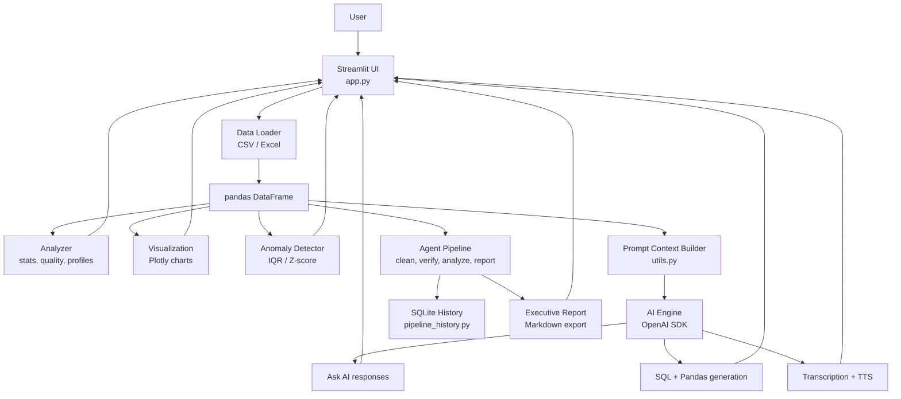

# AI Data Analyst

AI Data Analyst is a production-ready Streamlit analytics workspace that combines data profiling, interactive visualizations, natural-language analysis, anomaly detection, voice input/output, and AI-assisted SQL/Pandas code generation.

The app is designed as a demo-ready mini analytics platform: upload a CSV or Excel file, inspect the dataset, ask questions in natural language, generate charts, detect outliers, and produce executable analysis code.

## Live Demo

The app is deployed on Streamlit Community Cloud:

https://aidataanalyst-bfnglhzlgw6xyycnwarzrc.streamlit.app/

## Highlights

- Upload CSV and Excel datasets.
- Use the bundled sample dataset for instant demos.
- Explore dataset shape, schema, data quality, missing values, summary statistics, correlations, and column profiles.
- Ask AI questions with chat history, suggested prompts, selectable OpenAI model, and configurable reasoning effort.
- Use voice input and AI voice output for analyst-style conversations.
- Generate Plotly charts with chart recommendations.
- Detect anomalies with IQR and Z-score methods.
- Generate SQL and Pandas code from natural-language requests.
- Run an InsightFlow-style agentic pipeline with cleaning, verification, parallel analysis agents, and report synthesis.
- Use global filters and presentation mode for clean demos.
- Run with OpenAI SDK support for GPT-5 class models through the Responses API.

## Tech Stack

- Python 3.10+
- Streamlit
- pandas
- openpyxl
- Plotly
- matplotlib and seaborn
- OpenAI Python SDK
- python-dotenv

## Project Structure

```text
ai_data_analyst/
  app.py
  data_loader.py
  analyzer.py
  ai_engine.py
  visualization.py
  anomaly_detector.py
  pipeline_state.py
  pipeline_agents.py
  pipeline_orchestrator.py
  pipeline_history.py
  code_generator.py
  utils.py
  requirements.txt
  sample_data.csv
  voice_recorder/
    index.html
```

## System Architecture



The application follows a modular, single-process Streamlit architecture. Uploaded files are loaded into a pandas DataFrame, filtered in the UI, and passed to independent services for profiling, visualization, anomaly detection, AI analysis, and code generation.

### Runtime Flow

1. The user uploads a CSV/XLSX file or loads `sample_data.csv`.
2. `data_loader.py` validates the file type and returns a DataFrame.
3. `app.py` stores the working dataset in Streamlit session state.
4. Global filters create a filtered DataFrame used across all pages.
5. `analyzer.py`, `visualization.py`, and `anomaly_detector.py` generate deterministic analytics locally.
6. `pipeline_orchestrator.py` can run the approval-gated agent workflow over the active dataset view.
7. `pipeline_agents.py` performs cleaning, verification, trends, anomalies, correlations, insights, chart recommendations, and report synthesis.
8. `pipeline_history.py` persists completed agent runs in SQLite for demo history.
9. `utils.py` creates compact schema, sample, and summary context for AI prompts.
10. `ai_engine.py` calls OpenAI for natural-language answers, transcription, and voice output.
11. `code_generator.py` returns SQL, Pandas code, and an explanation for analyst requests.

### Design Principles

- Keep data loading, analysis, visualization, AI access, and code generation separate.
- Prefer deterministic local analytics before calling AI.
- Keep the agent pipeline auditable with visible cleaning actions and approval gates.
- Send compact dataset context to OpenAI instead of entire files.
- Keep API keys and generated artifacts out of Git.
- Make the UI demo-ready while preserving a clean Python module structure.

## Quick Start

```powershell
cd ai_data_analyst
python -m venv .venv
.\.venv\Scripts\activate
pip install -r requirements.txt
copy .env.example .env
streamlit run app.py
```

Then open the Streamlit URL shown in the terminal, usually:

```text
http://localhost:8501
```

## Environment Variables

Create `ai_data_analyst/.env` from `ai_data_analyst/.env.example`:

```env
OPENAI_API_KEY=your_openai_api_key_here
OPENAI_SSL=insecure
OPENAI_MODEL=gpt-5.2
STREAMLIT_DEMO_MODE=true
DEMO_AI_CALL_LIMIT=6
DEMO_SESSION_TOKEN_BUDGET=8000
```

`OPENAI_SSL=insecure` is intentionally supported for environments where corporate SSL inspection breaks OpenAI requests. This disables certificate verification for OpenAI API calls, so use it only in trusted local or corporate environments where this is required.

## Hosted Demo Cost Guard

The Streamlit version enables demo-mode cost controls by default so public users can try the app without accidentally creating a large API bill.

Default safeguards:

- 6 AI actions per browser session.
- 8,000 estimated tokens per browser session.
- 550 output tokens for Ask AI responses.
- 700 output tokens for Code Generator responses.
- 5,000 characters of dataset context sent to OpenAI.
- 1,200 characters per user prompt.
- 1,200 characters sent to text-to-speech.
- 2 MB maximum audio input for transcription.

These can be tuned in Streamlit Community Cloud secrets:

```toml
STREAMLIT_DEMO_MODE = "true"
DEMO_AI_CALL_LIMIT = "6"
DEMO_SESSION_TOKEN_BUDGET = "8000"
DEMO_CONTEXT_CHAR_LIMIT = "5000"
DEMO_MAX_REQUEST_CHARS = "1200"
DEMO_TEXT_OUTPUT_TOKENS = "550"
DEMO_CODE_OUTPUT_TOKENS = "700"
DEMO_TTS_CHAR_LIMIT = "1200"
DEMO_MAX_AUDIO_MB = "2"
```

Set `STREAMLIT_DEMO_MODE=false` only for private deployments where you control access and billing.

## Running The App

```powershell
cd ai_data_analyst
streamlit run app.py
```

The sidebar lets you upload data, load the sample dataset, view readiness checks, apply global filters, select the AI model, enable voice options, and navigate between analysis pages.

## Git And GitHub Workflow

This repository is configured for GitHub at:

```text
https://github.com/AryanHooda-04/AI_Data_Analyst.git
```

Recommended day-to-day workflow:

```powershell
git status
git pull --rebase origin main
git checkout -b feature/short-description
git add .
git commit -m "Describe the change"
git push -u origin feature/short-description
```

For small documentation or demo updates on `main`:

```powershell
git status
git add README.md ai_data_analyst/README.md
git commit -m "Update project documentation"
git push origin main
```

### Repository Hygiene

- `.env`, Streamlit secrets, logs, screenshots, caches, and virtual environments are ignored.
- Keep API keys out of commits.
- Commit README changes with related architecture or setup updates.
- Use short, meaningful commit messages.
- Run the Python syntax check before pushing application changes.

## Main Capabilities

### Overview

- Dataset preview with search and density controls.
- KPI cards for rows, columns, missing cells, numeric columns, date columns, and duplicates.
- Missing-value summary.
- Column type and profile tables.
- Correlation matrix for numeric fields.

### Ask AI

- Chat-style data questions.
- Suggested analyst prompts.
- OpenAI model selection, including GPT-5.2.
- Reasoning effort selector.
- Browser voice input through the microphone.
- AI voice output through OpenAI text-to-speech.

### Visualizations

- Histogram.
- Bar chart.
- Aggregated bar chart.
- Line chart.
- Scatter plot.
- Box plot.
- Correlation heatmap.
- Automatic chart recommendations based on selected columns.

### Insights And Anomalies

- Automated deterministic insights for trends, top categories, outliers, and distributions.
- IQR and Z-score anomaly detection.
- Highlighted anomalous rows.
- Plain-language glossary for statistical terms.

### Agent Pipeline

- Data Cleaning Agent proposes conservative cleaning actions.
- Verification Agent checks integrity before analysis.
- Human approval gate lets users approve cleaned data, analyze raw data, or reject the proposal.
- Trend, Anomaly, Correlation, Insights, and Visualization agents run as a parallel analysis fan-out.
- Report Synthesis Agent creates a downloadable Markdown executive report.
- Completed runs are saved to local SQLite history for previous-analysis review.

### Code Generator

- Natural-language request input.
- AI-generated SQL query.
- Pandas equivalent code.
- Short explanation and assumptions.

### Presentation Mode

- Clean executive-style dashboard view.
- KPIs, key insights, and high-impact charts only.
- Useful for demos and interview walkthroughs.

## Voice Features

Voice input uses the browser microphone through a lightweight Streamlit component in `voice_recorder/index.html`. The recorded audio is transcribed with the configured OpenAI transcription model. Voice output uses OpenAI text-to-speech and returns playable audio inside the UI.

Your browser may ask for microphone permission the first time you use voice input.

## Security Notes

- Do not commit `.env` or Streamlit secrets.
- API keys are loaded from environment variables or `.env`.
- Uploaded datasets are processed locally by Streamlit unless you send context to OpenAI through the AI features.
- The app only sends compact schema, sample rows, and summary context to OpenAI to reduce token usage.

## Troubleshooting

If OpenAI calls fail with SSL certificate errors, confirm:

```env
OPENAI_SSL=insecure
```

If voice input does not start, confirm the page is loaded from `localhost` and microphone permission is allowed in the browser.

If Streamlit reports duplicate chart IDs, restart the app and ensure you are running the latest code. All Plotly charts in the app use explicit unique keys.

## License

This project is intended as a portfolio, interview, and internal demo application. Add a license file before publishing for public reuse.
