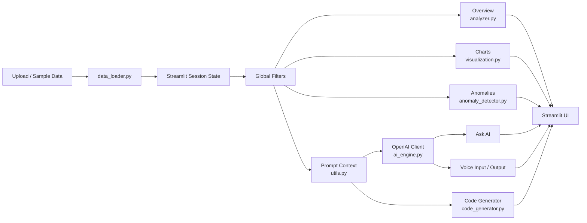

# AI Data Analyst App

This folder contains the Streamlit application source code for AI Data Analyst.

## Run Locally

```powershell
python -m venv .venv
.\.venv\Scripts\activate
pip install -r requirements.txt
copy .env.example .env
streamlit run app.py
```

Set your OpenAI key in `.env` before using AI, transcription, or text-to-speech features:

```env
OPENAI_API_KEY=your_openai_api_key_here
OPENAI_SSL=insecure
OPENAI_MODEL=gpt-5.2
```

## Modules

- `app.py` - Streamlit UI, navigation, layout, filters, voice controls, and page rendering.
- `data_loader.py` - CSV and Excel upload handling.
- `analyzer.py` - Summary statistics, missing values, column profiling, data health, and deterministic insights.
- `ai_engine.py` - OpenAI client setup, GPT-5 compatible completion calls, transcription, and text-to-speech.
- `visualization.py` - Plotly chart builders.
- `anomaly_detector.py` - IQR and Z-score outlier detection.
- `code_generator.py` - AI-generated SQL and Pandas code.
- `utils.py` - Prompt context formatting and dataframe helpers.
- `voice_recorder/index.html` - Browser microphone recorder component used by Streamlit.
- `sample_data.csv` - Demo dataset for quick walkthroughs.

## Application Architecture



### Module Responsibilities

- UI layer: `app.py` owns page layout, navigation, session state, filters, model controls, and Streamlit rendering.
- Data layer: `data_loader.py` converts uploaded files into DataFrames.
- Analytics layer: `analyzer.py` and `anomaly_detector.py` produce local statistics, quality checks, insights, and outliers.
- Visualization layer: `visualization.py` returns Plotly figures with consistent styling.
- AI layer: `ai_engine.py` manages OpenAI clients, SSL mode, Responses API calls, transcription, and text-to-speech.
- Prompt layer: `utils.py` limits context size and formats schema, samples, and summary statistics.
- Code layer: `code_generator.py` turns a natural-language request into SQL, Pandas code, and explanation.

### Data And AI Boundary

The app does not blindly send the entire dataset to OpenAI. It builds a compact prompt context containing schema, data types, a limited sample, and summary statistics. This keeps requests smaller, easier to reason about, and safer for demos.

## OpenAI Model Support

The app defaults to `gpt-5.2` and lets the user select or enter another model from the sidebar. GPT-5 and reasoning models are routed through the OpenAI Responses API. Older chat models use Chat Completions.

Reasoning effort can be set from the UI when using supported models.

## SSL Configuration

The code defaults `OPENAI_SSL` to `insecure` when it is not set. When this mode is active, OpenAI API requests use an HTTP client with certificate verification disabled:

```python
OpenAI(http_client=DefaultHttpxClient(verify=False))
```

This is useful in local corporate environments where SSL inspection blocks API calls. Use normal certificate verification outside that environment.

## Git Workflow

From the repository root:

```powershell
git status
git pull --rebase origin main
git add ai_data_analyst
git commit -m "Update AI data analyst app"
git push origin main
```

Before pushing application code, run:

```powershell
python -m py_compile app.py data_loader.py analyzer.py ai_engine.py visualization.py anomaly_detector.py code_generator.py utils.py
```

The repo ignores `.env`, `.streamlit/secrets.toml`, logs, generated screenshots, Python caches, and virtual environments.

## Demo Flow

1. Load `sample_data.csv` from the sidebar.
2. Review the Overview readiness checks and correlations.
3. Ask AI: `What are the most important trends in this dataset?`
4. Open Visualizations and chart revenue by region or over time.
5. Review Insights & Anomalies with IQR detection.
6. Generate SQL and Pandas code for a business question.
7. Switch to Presentation Mode for a clean executive summary.

## Development Checklist

- Keep generated screenshots and logs out of Git.
- Keep `.env` local only.
- Run a syntax check after edits:

```powershell
python -m py_compile app.py data_loader.py analyzer.py ai_engine.py visualization.py anomaly_detector.py code_generator.py utils.py
```

- Launch Streamlit and verify the main pages before publishing:

```powershell
streamlit run app.py
```
